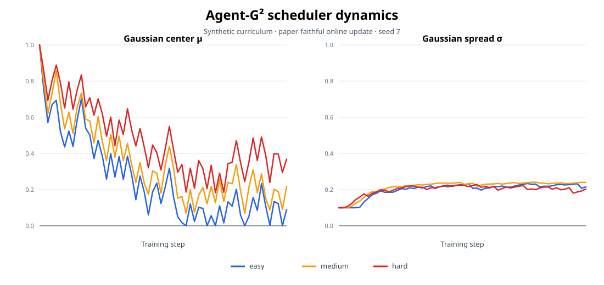

# Agent-G²：论文一致性复现

这是一个面向可验证结果的独立复现分支。它保留上游训练框架，同时将论文公式、实际实现和实验配置拆成可单独审计的组件。

当前阶段没有把论文报告的数字当作本项目结果。只有本分支实际产生、保存了配置和日志的实验，才会进入最终结果表与简历描述。

## 已完成

- 用 Python 标准库独立实现 Gaussian Guidance scheduler；
- 覆盖全局基线、难度偏置、动态方差、高斯采样和前缀边界测试；
- 自动审计论文 Table 5 与官方 ALFWorld recipe 的 12 个关键字段；
- 审计 3,553 条公开 ALFWorld 专家轨迹及论文 K=3 难度划分；
- 使用固定 revision 的官方 Qwen tokenizer 精确量化 action/token 前缀差异；
- 识别 7 项标量配置差异及 2 项运行时语义差异；
- 修正任务级成功率聚合和 action-level prefix length；
- 提供不覆盖上游脚本的论文一致启动器；
- 生成可复现的 scheduler dynamics 仿真图。
- 通过 CPU CI 自动运行测试并验证审计报告与图表没有漂移。
- 每次单卡实验自动保存命令、代码状态、依赖、GPU provenance、完整控制台日志、逐步指标和退出状态。
- 自动剔除失败/不完整运行，并拒绝混合不同代码、数据或预算的结果汇总。
- 在单张 RTX 4090 24GB 上完成 8-step LoRA 端到端 smoke test，并从 step 8 成功续训到 step 9。
- 验证主断点包含 18,464,768 个非零 LoRA 参数；导出的 73.9 MB PEFT adapter 可重新加载。



在合成 curriculum 中，较难任务（红色）保持更深的 guidance center；三个难度簇的 spread 会依据簇内响应差异在线变化。该图只验证调度机制，不代表 ALFWorld 实验结果。

## 核心方法

每个任务先按专家轨迹长度划入难度簇。训练过程中，已有 GRPO rollouts 同时更新策略和 guidance scheduler：

```text
μᵢ = clip(μ_global + λ(0.5 - Aₖ), 0, 1)
σᵢ = max(γVₖ, σ_min)
rᵢ ~ Normal(μᵢ, σᵢ²)
nᵢ = min(ceil(rᵢLᵢ), Lᵢ - 1)
```

`Aₖ` 和 `Vₖ` 分别是任务级成功率的 EMA 均值与方差。一个任务的 `R` 次 rollout 共享同一段专家前缀，所以 scheduler 不需要额外 probe rollouts。

## 可复现检查

```bash
# CPU-only：核心公式、边界、配置审计
python -m unittest discover -s tests/reproduction -v

# 重新生成论文—代码配置审计
python -m reproduction.audit_config

# 重新生成专家数据审计与长度分布图
python -m reproduction.analyze_alfworld_data

# 重新生成调度仿真与 SVG
python -m reproduction.simulate_scheduler
python -m reproduction.render_scheduler_svg

# CUDA 环境：按论文 Table 5 启动 ALFWorld 训练
bash reproduction/run_alfworld_paper_table5.sh

# 下载固定 revision 的作者 checkpoint，并只做无 guidance 验证
python -m reproduction.download_public_checkpoint --local-dir /data/models/agent-g2-alfworld-1.5b
bash reproduction/run_alfworld_checkpoint_eval.sh /data/models/agent-g2-alfworld-1.5b 1

# 下载并校验固定 revision 的 Qwen 基础模型；训练时使用本地快照
python -m reproduction.download_base_model --local-dir /data/models/qwen2.5-1.5b-instruct
export BASE_MODEL_PATH=/data/models/qwen2.5-1.5b-instruct

# 单张 24GB GPU：默认 LoRA rank 16，同预算运行主方法与两个关键基线
bash reproduction/run_alfworld_smoke.sh 1
RUN_TAG=l2-v1 bash reproduction/run_alfworld_l2_cohort.sh primary 1

# 论文 Table 3 的三项关键消融
RUN_TAG=l2-v1 bash reproduction/run_alfworld_l2_cohort.sh ablations 1

# 同一命名实验组完成后，生成受约束的结果表
python -m reproduction.summarize_results --run-glob '*_l2-v1'
```

配置差异的自动报告见 [`reports/config_audit.md`](reports/config_audit.md)，分层实验计划见 [`PLAN_zh.md`](PLAN_zh.md)。
数据统计和 action/token 前缀差异证据见 [`reports/alfworld_data_audit.md`](reports/alfworld_data_audit.md)。
精确 tokenizer 审计见 [`reports/tokenizer_prefix_audit.md`](reports/tokenizer_prefix_audit.md)：ratio 0.5 时有 1,278/3,553 条轨迹（36.0%）选择不同的动作前缀。
云端安装、smoke test、正式实验和 OOM 排查见 [`CLOUD_RUNBOOK_zh.md`](CLOUD_RUNBOOK_zh.md)。
AutoDL 的 SSH、工作区同步与 Codex 远程项目配置见 [`AUTODL_REMOTE_zh.md`](AUTODL_REMOTE_zh.md)。
AutoDL 环境可通过 `bash reproduction/bootstrap_autodl.sh` 一键初始化，并把大体积缓存固定到数据盘。
8-step smoke test 完成后，可用 `python -m reproduction.estimate_rental_budget` 按实测耗时估算主实验与完整消融的租用预算。
本次 RTX 4090 实测证据与限制见 [`reports/gpu_smoke_report.md`](reports/gpu_smoke_report.md)，80-step 顺序运行预算见 [`reports/autodl_budget.md`](reports/autodl_budget.md)。
当前可用的简历表述、GPU 完成后的升级模板与面试讲法见 [`RESUME_zh.md`](RESUME_zh.md)。

## GPU 实验验收

受限算力实验必须在同一模型、数据划分、训练步数和 rollout 预算下完成以下对照：

1. GRPO（无 hint）；
2. Target-accuracy scalar hint；
3. Agent-G² dynamic Gaussian；
4. fixed sigma；
5. no auxiliary SFT；
6. deterministic mean（不采样）。

每项至少运行 3 个随机种子，并报告成功率均值/标准差、mismatch ratio、rollout 数和 GPU-hours。结果录入格式见 [`reports/RESULTS_TEMPLATE.md`](reports/RESULTS_TEMPLATE.md)。

汇总器只接受 `run_status=completed`、退出码为 0，且在预期最终 step 写有 `val/success_rate` 的运行。不同 `git commit + diff hash`、专家数据 hash 或核心预算字段会直接报错，而不是生成不可比表格。这里的 expert mismatch 指训练任务未匹配到公开专家轨迹的加权比例；训练 rollout 数不包含验证 episodes。

单卡入口默认使用 Qwen2.5-1.5B、LoRA rank 16、4 tasks/step、4 rollouts/task 和 80 个优化步骤，并通过 optimizer/parameter offload 与较小 micro-batch 适配 24GB 显存。实测表明单卡 full-parameter AdamW 在第一次创建优化器状态时超过 RTX 4090 的 24GB 显存，因此 L2 结果必须标注为 LoRA 受限算力复现；论文原始单机 8-GPU full-parameter recipe 仍由 `run_alfworld_paper_table5.sh` 保留。所有方法共用完全相同的 LoRA 与 rollout 预算；参数变更必须同步应用到全部方法。

## 项目边界

- CPU 仿真用于验证 scheduler 行为，不代替环境训练。
- 作者 checkpoint 评测用于核验公开结果，不算独立训练复现。
- 简历中的提升数字必须来自本分支的同预算对照实验。
