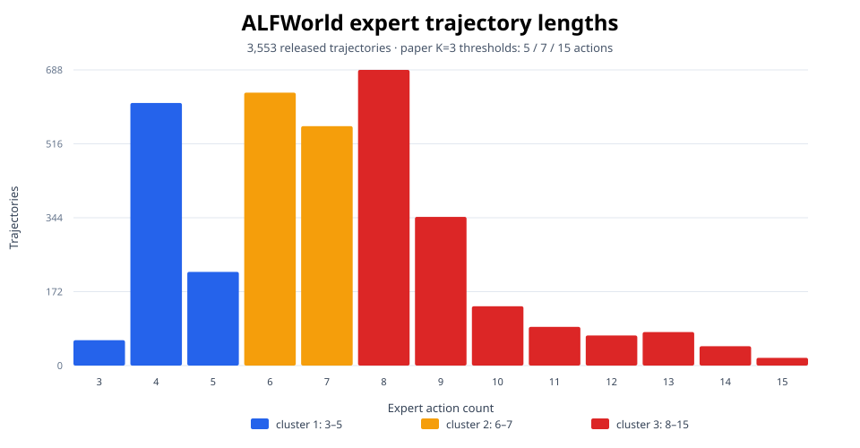

# ALFWorld expert-data audit

Dataset SHA-256: `1f9d2bd6b9a5a88c06a99f521c63828c00a5494ed346aa2953fcc5764f749a66`

## Dataset summary

The released file contains **3,553 expert trajectories**. Expert action count ranges from **3 to 15**, with mean **7.08** and median **7**.

| Task type | Trajectories | Share |
|---|---:|---:|
| Pick2 | 813 | 22.9% |
| Pick | 790 | 22.2% |
| Clean | 650 | 18.3% |
| Cool | 533 | 15.0% |
| Heat | 459 | 12.9% |
| Look | 308 | 8.7% |

## Paper K=3 difficulty clusters

The upstream balanced-by-length rule yields thresholds **[5, 7, 15]**.

| Cluster | Expert actions | Trajectories | Share |
|---:|---|---:|---:|
| 1 | 3–5 | 888 | 25.0% |
| 2 | 6–7 | 1,192 | 33.5% |
| 3 | 8–15 | 1,473 | 41.5% |

## Action-based vs. text-mass prefix depth

The paper defines prefix depth from expert **action count**. The released runtime previously used tokenizer length. Without downloading the Qwen tokenizer, the following diagnostic uses whitespace word count on the same `Step N: action` formatting as a transparent proxy; it demonstrates sensitivity to action text length but is not an exact tokenizer-level measurement.

| Guidance ratio | Different prefix steps | Mismatch rate | Mean absolute step difference |
|---:|---:|---:|---:|
| 0.1 | 37 | 1.0% | 0.010 |
| 0.2 | 110 | 3.1% | 0.031 |
| 0.3 | 424 | 11.9% | 0.119 |
| 0.4 | 377 | 10.6% | 0.106 |
| 0.5 | 973 | 27.4% | 0.274 |
| 0.6 | 518 | 14.6% | 0.146 |
| 0.7 | 171 | 4.8% | 0.048 |
| 0.8 | 75 | 2.1% | 0.021 |
| 0.9 | 0 | 0.0% | 0.000 |

At guidance ratio 0.5, the text-mass proxy changes the chosen prefix step for **973/3,553 trajectories (27.4%)**. This supports treating the action/token distinction as an experiment-affecting semantic discrepancy rather than a cosmetic implementation detail.
The follow-up [`tokenizer_prefix_audit.md`](tokenizer_prefix_audit.md) replaces this proxy with the exact tokenizer from a pinned public-checkpoint revision.

Generated by `python -m reproduction.analyze_alfworld_data`.
